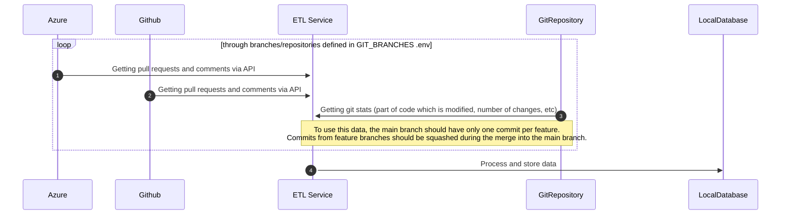

# Overview

This tool aims to enhance the understanding and improvement of pull request (PR) reviews within a team.

It provides operational indicators and dashboards to analyze review dynamics, such as review time, number of comments per review, etc., across one or multiple repositories.


# Getting started

## Displaying dashboards

To quickly try the tool, load the test dataset with the following steps:

1. Execute `make start` to run dockers.
2. Use `make load_demo_dataset` to load the demo dataset into the database.
3. Access the main dashboard at [http://localhost:3000/dashboards](http://localhost:3000/dashboards) with the following credentials:
   - User: admin
   - Password: admin

## Loading a real repository hosted on GitHub or Azure

1. Launch the script `./init.sh`.
2. Fill in the `GIT_BRANCHES` in `.env` to specify the repositories to load.

   - The format should be a JSON array without line breaks.

     ```json
     [
       {
         "name": "git branch name",
         "repository": {
           "organisation": "Azure or Git organization",
           "project": "project name (used by Azure)",
           "name": "remote repository name",
           "url": "remote SSH URL for cloning the repository",
           "token": "GitHub or Azure personal access token"
         }
       }
     ]
     ```

3. Run dockers with `make start`.
4. Execute `setup_db` to create and init the database.
5. Run the command `make check_settings` to verify connections to the repositories.

   - If an error occurs, check `.env` or verify the correctness of the GitHub or Azure personal access token.

6. Clone repositories with `make clone_repositories`.

   - This command copies SSH keys into `./git/.ssh` and clones repositories into `./git/repositories/*`.

7. Collect data:

   - Load information about reviews into the local database using `make load_pull_requests_review_informations`.
   - Load information about features added over time with `make load_features_from_repositories`.

   **Note:** Be patient, as it may take several minutes to retrieve all the data. Subsequent launches will be quicker as only changes are loaded.

8. Access the main dashboard at [http://localhost:3000/dashboards](http://localhost:3000/dashboards) with the following credentials:
   - User: admin
   - Password: admin

# Commands and Features

## Check Configuration

Use `make check_settings` to verify connections to the repositories for cloning and API calls.

This command ensures that `.env` is correct and everything works as expected when loading pull requests, comments, and features.

## Load Pull Requests and Comments

To load pull requests and comments, use `make load_pull_requests_review_informations`.

This command loads data by delta, avoiding the need to reload all data each time. It calls Azure and GitHub APIs to get pull requests and comments, processing and uploading them into the database.

## Load Features

To load information about features added over time, use `make load_features_from_repositories`.

This command also loads data by delta. It clones repositories, extracts git information, and uploads them into the `features` database table.

## Transcode Data

### Developers and Reviewers

For developers contributing with different accounts, use `make transcode_into_database` to group contributions.

1. Copy `postgres/transco/transcoders.json.example` to `postgres/transco/transcoders.json`.
2. Complete the `developers_names_by_email` section.
3. Apply updates with `make transcode_into_database`.

**Example**

```
Some developers may contribute with different accounts to a repository.
For instance, you may find some commits or reviews associated with these different email addresses:
- `alain.dupont@company.com`
- `a.dupont@company.com`
- `alain.dupont@perso.com`.
In such cases, you'll want to group all of them under the name "Alain DUPONT."
```

### Pull Requests Type

For setting pull request types based on branch names, use `make transcode_into_database`.

1. Copy `postgres/transco/transcoders.json.example` to `postgres/transco/transcoders.json`.
2. Complete the `pull_requests_type` section.
3. Apply updates with `make transcode_into_database`.

**Example**

```
By default, the type is set to "feat" for all branches.

However, if you have a branch-naming policy, such as starting all feature branches with "feat/", "fix/" or "release/",
you may want to filter or exclude certain branch types on dashboards.

For example:
- "feat/add_button" and "feat/new_screen" could be of type "feat,"
- "fix/infinite_loop" and "fix/display_bug" could be of type "fix."
```

## Clear database data

Run `make setup_db` to clear all data and starts importing from scratch.

## Dump Database to JSON (and reimport)

Run `make dump_db` to dump the database to JSON files. Reimport later with `make init_db_from_json_files`.

## Dump ANONYMIZED Database to JSON (and reimport)

Run `make create_demo_dataset` to dump and anonymize the database. Reimport later with `make load_demo_dataset`.

# How does it work?

## Data collection process (ETL)



## Dashboards

Dashboards, built with Grafana, provide operational indicators and data exploration:

- [Metrics](http://localhost:3000/d/metrics) dashboard displays operational indicators
- [Details: Pull Requests](http://localhost:3000/d/a941e1ee-5af5-44e3-b8ab-e729b06cabaa) and [Details: Comments](http://localhost:3000/d/e1af86ef-0235-408a-9476-385c460b0089) allow checking or displaying lists of pull requests and comments.

## Project structure

The project follows domain-driven design principles:

- Collected data is modeled into entities (cf. `domain/entities`)
- Various repositories (in the meaning of DDD) load and/or upload entities from/to different sources (Azure, GitHub, JSON, Git, Database)
- Domain base use cases are defined in `domain/use_cases` and more complex uses cases are defined in `app/controllers`
- APIs routes or commands in the presentation layer define how to manipulate use cases

## Tests

Run `make run_test_database` before running tests to run the database used as a mock for tests and `make tests` to run all tests
